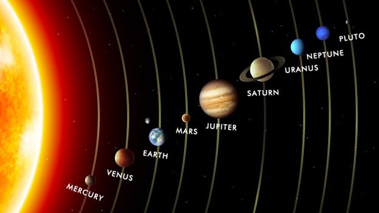

# Tu-Peso-en-Otro-Planeta
Programa HTML y Javascript que calcula tu peso el Sistema Solar, pidiendo tu peso en Kilogramos y eligiendo el planteta

Del curso de Programacion Basica de Platzi, donde se muetra como usar las funciones, y operaciones matematicas, asi como
la estrucura IF-ELSE, y alertas en el navegador.
																	!!
																	
																	

