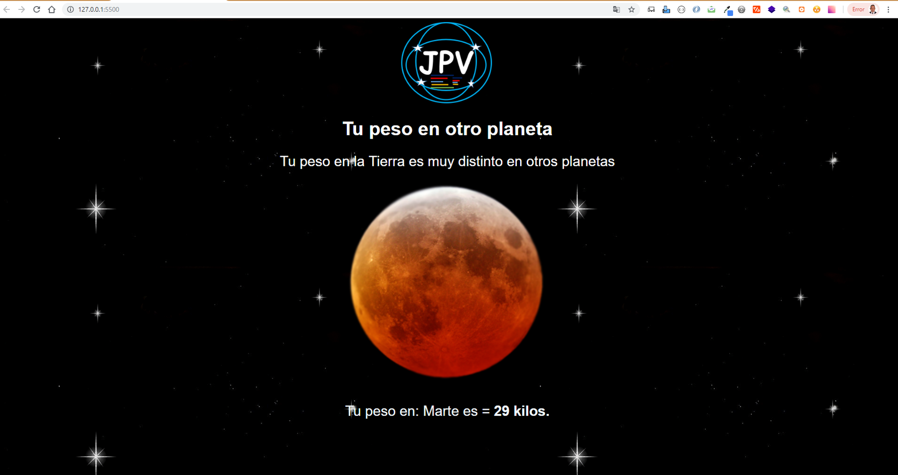

# Tu-Peso-en-Otro-Planeta

URL DEL PROYECTO: https://juancitopena.github.io/Tu-Peso-en-Otro-Planeta/index.html
										
Programa HTML, CSS y Javascript que calcula tu Peso en Otro Planeta del Sistema Solar, Requiriendo tu peso en Kilogramos y eligiendo el planeta que deas saber cuanto pesas alla de acuerdo a la Gravedad, se hace uso de funciones, Variables, estructuras selectivas, y comparativas en el Nevegador y operaciones matematicas.

FOTO PC:

!!

FOTO MOVIL:

!!

FOTO MOVIL:

!!

							

